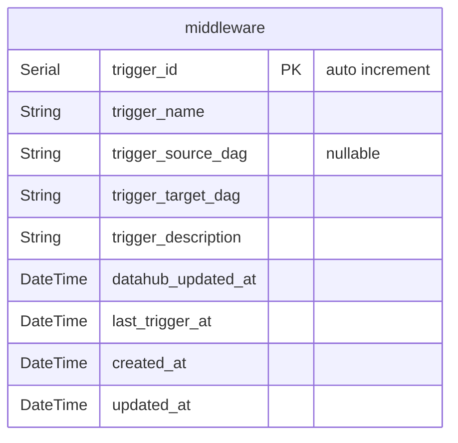

```mermaid
erDiagram
"middleware" {
  Serial trigger_id PK "auto increment"
  String trigger_name
  String trigger_source_dag "nullable"
  String trigger_target_dag
  String trigger_description
  DateTime datahub_updated_at
  DateTime last_trigger_at
  DateTime created_at
  DateTime updated_at   
}

```
